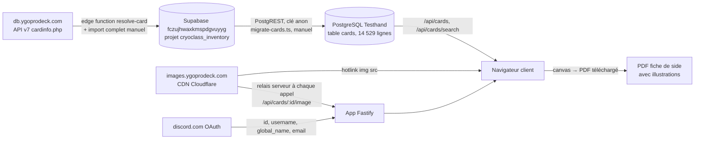

# Audit 03 — Données externes, propriété intellectuelle, fraîcheur du catalogue, RGPD

- **Date** : 14 septembre 2026. Code audité : `main` à `cff8a75` (prod déclarée `4cf9493`, docs/PLAN.md:50).
- **Prisme** : commercialisation en freemium (offre gratuite limitée + abonnement), avec des inconnus comme utilisateurs.
- **Nature** : constats techniques sourcés et pratiques observées. **Ce n'est pas un avis juridique.** Toute conclusion de droit reste à faire valider par un juriste (propriété intellectuelle et droit de la consommation).
- **Périmètre respecté** : aucun fichier du projet modifié hors `docs/audit/`, aucun commit, aucune commande vers le VPS, la base de prod ou la Supabase. Méthode, commandes et un incident de manipulation sont décrits au §8.

---

## 0. Synthèse : ce qui empêche de vendre en l'état

| # | Blocage | Nature | Preuve principale |
|---|---|---|---|
| B1 | Chaque navigateur client charge les images de cartes directement sur `images.ygoprodeck.com`, en continu. La page d'utilisation de l'API YGOPRODeck l'interdit explicitement, sous peine de blocage de l'adresse IP. | Conditions de la source | `web/src/types.ts:96-101` ; 23 requêtes vers le CDN sur un seul parcours (§1.3) ; guide API cité au §2.1 |
| B2 | L'app affiche les visuels complets des cartes (illustration, cadre, texte imprimé), le texte d'effet intégral et les noms. Elle intègre aussi les illustrations dans un PDF téléchargeable. Aucun accord avec Konami, aucune mention, aucun avertissement. La tolérance de Konami envers les fans est présentée comme limitée au non commercial. | Propriété intellectuelle de Konami | captures `04-editor.png`, `05-card-detail.png` ; `web/src/lib/sideSheetPdf.ts:108` ; §2.2 |
| B3 | Le catalogue dépend d'une Supabase **personnelle d'un autre projet** (`cryoclass_inventory`), lue avec une clé anon écrite en dur. Sa mise à jour est entièrement manuelle, sans planification, et le catalogue est figé au 31 août 2026. | Fiabilité et fraîcheur | `server/scripts/migrate-cards.ts:19-21` ; `deploy/README.md:172-185` ; §4 |
| B4 | Il n'existe aucun moyen de supprimer son compte, d'exporter ses données, de changer ou de réinitialiser son mot de passe, ni de vérifier son email. Il n'y a ni politique de confidentialité, ni mentions légales, ni CGU/CGV. | RGPD et droit de la consommation | `server/src/routes/auth.ts` (routes complètes), capture `01-login.png` ; §5 |
| B5 | Les adresses IP des clients et les URL de toutes les requêtes sont journalisées sur la sortie standard, sans durée de conservation définie. La documentation affirme le contraire. | RGPD (conservation, information) | preuve d'exécution §5.1 ; `AGENTS.md:60` |
| B6 | L'hébergement réel est un VPS **OVH** (Lille). Le brief évoque **Azure** : l'écart est à lever avant tout registre ou toute politique de confidentialité. | Information exacte des personnes | `deploy/README.md:15`, `deploy/docker-compose.prod.yml:1`, ipinfo §5.3 |

Point rassurant : **le calcul ne dépend pas des données de Konami ni de YGOPRODeck**. Le moteur travaille sur des passcodes et sur les annotations de l'utilisateur. Le catalogue n'est qu'une table de correspondance, sans clé étrangère (`db/schema.sql:41-45`). On peut donc réduire, remplacer ou supprimer les visuels et les textes sans toucher aux probabilités.

---

## 1. Cartographie des données externes

### 1.1 Chaîne d'approvisionnement



### 1.2 Inventaire, donnée par donnée

| Donnée | Source exacte | Mode | Fichier responsable | Volume mesuré |
|---|---|---|---|---|
| Identifiant de carte (passcode) | Passcodes Konami, via l'API YGOPRODeck, puis la Supabase | **Copie** (upsert) | `server/scripts/migrate-cards.ts:67-78, 182-205` ; `db/schema.sql:9` | 14 529 lignes, dont 192 passcodes provisoires ≥ 100 000 000 (requête §8) |
| Nom de carte (anglais seulement) | Champ `name` de l'API YGOPRODeck (`resolve-card/index.ts:398` du projet cryoclass) → Supabase `cards.name` | **Copie** | `migrate-cards.ts:27-40` | 278 045 octets |
| Texte d'effet | Champ `desc` de l'API → `cards.description` (`resolve-card/index.ts:402`) | **Copie** | `migrate-cards.ts:36` | 14 529 textes non nuls, 4 556 577 octets |
| Métadonnées : type, race, attribut, ATK, DEF, niveau | Champs de l'API → Supabase | **Copie** | `migrate-cards.ts:29-35` | table `cards` : 24 Mo au total (index compris) |
| URL d'images (3 colonnes) | `card_images[0]` de l'API (`resolve-card/index.ts:394, 411-413`) | **Copie de l'URL seulement**, pas de l'image | `migrate-cards.ts:37-39` | 100 % sur `https://images.ygoprodeck.com` (requête §8) |
| Vignette (carte entière, cadre et texte compris) `cards_small/<id>.jpg` | CDN `images.ygoprodeck.com` (Cloudflare) | **Hotlink** depuis le navigateur | `web/src/types.ts:96-98`, `CardImage.tsx:11`, `HandWall.tsx:184`, `HomePage.tsx:279`, `SideSheet.tsx:140` | ≈ 25 à 26 Ko par image (en-têtes `Content-Length` de 25 448 et 26 325 octets) |
| Illustration rognée `cards_cropped/<id>.jpg` | Même CDN ; le guide de l'API crédite l'équipe « Duelists Unite » pour ces images rognées | **Hotlink** | `web/src/types.ts:99-101`, `CardDetailDialog.tsx:17` | 112 173 octets sur un échantillon |
| Vignette relayée | Même CDN, adresse fixe | **Relais serveur** à chaque appel, sans stockage côté serveur ; `cache-control: private, max-age=86400` pour le navigateur | `server/src/routes/cards.ts:51-66`, `server/src/domain/cardImage.ts:6-13` | 1 appel sortant par image demandée |
| Illustrations dans le PDF | Relais ci-dessus, rasterisé par canvas | **Copie intégrée** dans un fichier remis à l'utilisateur | `web/src/lib/sideSheetPdf.ts:208-252, 108` ; `SideSheet.tsx:142-145` | 1 image par carte entrante ou sortante des plans |
| Version du référentiel | Table `dataset_versions` de la Supabase | Copie d'une ligne dans `catalog_version`, exposée publiquement par `/api/health` | `migrate-cards.ts:54-65, 133-180` ; `server/src/index.ts:53-74` | 1 ligne (`2026-08-31`) |
| Identité Discord | `discord.com/api/users/@me`, portée `identify email` | API OAuth, copie de l'email et du nom affiché | `server/routes/discord.ts:105, 141-145, 189-197` | par compte lié |
| Clé d'accès à la source | URL et clé anon de la Supabase | **Écrites en dur** comme valeurs par défaut, et publiées dans le dépôt | `migrate-cards.ts:19-21`, `prune-stale-cards.ts:48-50`, `.env.example`, `reutiliser-la-bdd.md:14-15` | — |

Non utilisés par Testhand, bien que présents dans la source : `card_printings`, `card_translations`, prix, banlist, `raw_json` (`migrate-cards.ts:3-4`).

### 1.3 Mesure au navigateur (pile jetable, cartes réelles)

Parcours joué : inscription, import d'un deck de 14 cartes réelles, éditeur, détail d'une carte, accueil. Toutes les requêtes sortantes ont été enregistrées (`docs/audit/captures-03/log.json`) :

```json
"externalRequests": {
  "images.ygoprodeck.com": { "count": 23, "types": ["image"],
    "paths": ["/images/cards_small/<id>.jpg", "/images/cards_cropped/<id>.jpg"],
    "referers": ["http://localhost:8795/"] } }
```

- **Seul hôte tiers contacté : YGOPRODeck.** Aucune police externe, aucune mesure d'audience, aucun script tiers (`web/index.html:1-12`).
- **Chaque requête d'image transmet au CDN l'adresse IP du client et l'origine de l'app en Referer.** En production, ce Referer vaudrait `https://analysis.scratchrecode.com/` par inférence : seul le référent local a été mesuré.
- **Le CDN ne renvoie aucun en-tête CORS.** `curl -sI …/cards_small/14558127.jpg | grep -ci access-control-allow-origin` renvoie `0`, ce qui confirme `cardImage.ts:1-3`.
- **Le relais fonctionne.** `GET /api/cards/14558127/image` a répondu `200 image/jpeg`, 26 325 octets, `private, max-age=86400`.

Captures : [01-login](captures-03/01-login.png) (aucun lien légal), [04-editor](captures-03/04-editor.png) (cartes complètes, texte imprimé lisible), [05-card-detail](captures-03/05-card-detail.png) (illustration rognée et texte d'effet intégral), [06-home-deck](captures-03/06-home-deck.png) (8 vignettes par deck).

---

## 2. Risques, analysés séparément

### 2.1 Conditions d'utilisation de YGOPRODeck et hotlinking de son CDN

**Ce que dit la source.** Page [ygoprodeck.com/api-guide](https://ygoprodeck.com/api-guide/), consultée le 14 septembre 2026, citations exactes :

- « Do not continually hotlink images directly from this site. Please download and re-host the images yourself. Failure to do so will result in an IP blacklist. »
- « Please only pull an image **once** and then store it locally. If we find you are pulling a very high volume of images per second then your IP will be blacklisted and blocked. »
- « Please download and store all data pulled from this API locally to keep the amount of API calls used to a minimum. »
- « The rate limit is 20 requests per 1 second. If you exceed this, you are blocked from accessing the API for 1 hour. »
- « The literal and graphical information presented on this site about Yu-Gi-Oh!, including card images, the attribute, level/rank and type symbols, and card text, is copyright 4K Media Inc, a subsidiary of Konami Digital Entertainment, Inc. »

**Ce que fait le code, face à chaque règle :**

| Règle | Pratique observée | Écart |
|---|---|---|
| Ne pas hotlinker en continu | Toutes les vignettes et illustrations sont en `` (§1.2), à chaque affichage et pour chaque utilisateur | **Contraire** |
| Tirer une image une seule fois, puis la stocker | Le relais refait un `fetch` amont à chaque appel, sans rien stocker (`cards.ts:56`) | **Contraire** |
| Stocker les données localement | Le catalogue est copié localement (Supabase de cryoclass, puis table `cards`) | Conforme |
| 20 requêtes par seconde (API) | Testhand n'appelle jamais l'API directement (grep `db.ygoprodeck` : aucune occurrence dans le dépôt) | Sans objet ici ; concerne cryoclass |
| Pas de licence commerciale publiée | La page Premium ([ygoprodeck.com/premium](https://ygoprodeck.com/premium/), 4,99 €/mois hors taxes) ne mentionne aucune licence d'usage commercial de l'API ou des images | Aucun cadre écrit trouvé |

**Conséquences concrètes, par ordre de probabilité :**

1. **Blocage de l'IP du VPS (137.74.172.32).** Les illustrations du PDF disparaissent ; le code prévoit un repli sur un cadre portant le nom de la carte (DECISIONS.md:25-31). Le relais n'a ni limite de débit ni cache : un PDF de N cartes déclenche N appels amont.
2. **Blocage visant les navigateurs.** Il pourrait se faire par IP (client par client) ou par Referer (tous les clients d'un coup). Filtrer par Referer est techniquement possible sur Cloudflare, mais **rien ne prouve que YGOPRODeck le pratique** (voir « Non vérifié »). L'effet serait des cartes en image cassée sur tous les écrans : grille, mur de mains, accueil, détail.
3. **Le volume grandit avec le nombre de clients.** Aujourd'hui, les inscriptions sont fermées par des codes d'invitation (`server/src/routes/auth.ts:11-16, 60-66`). Un freemium ouvert multiplie les requêtes vers le CDN.

**Point à ne pas confondre avec le §2.2.** Même en respectant parfaitement le guide de l'API (images téléchargées une fois et hébergées chez soi), on ne règle **que** la relation avec YGOPRODeck. Le guide rappelle lui-même que les images et les textes appartiennent à 4K Media / Konami. Il ne concède aucun droit sur eux.

### 2.2 Propriété intellectuelle de Konami (visuels, noms, textes)

**Ce que l'app reproduit aujourd'hui :**

| Élément | Où | Preuve |
|---|---|---|
| Visuel complet de la carte (illustration, cadre, symboles, texte imprimé) | grille d'annotation, mur de mains, accueil, fiche à l'écran | `04-editor.png`, `06-home-deck.png` ; `CardImage.tsx:11`, `HandWall.tsx:184`, `HomePage.tsx:279` |
| Illustration seule, rognée | dialogue de détail | `05-card-detail.png` ; `CardDetailDialog.tsx:17` |
| Texte d'effet intégral | dialogue de détail | `CardDetailDialog.tsx:34-36` ; texte d'« Infinite Impermanence » visible sur `05-card-detail.png` |
| Noms de cartes | partout (tuiles, recherche, fiche, PDF) | `AddCardDialog.tsx:142`, `sideSheetPdf.ts:117, 137` |
| Illustrations dans un fichier distribué | PDF « Télécharger le PDF » | `sideSheetPdf.ts:108, 251` |
| Mention de droits ou de non-affiliation | **aucune** | grep `konami\|ygoprodeck\|©\|trademark` sur `web/src/**/*.tsx` : 0 occurrence pertinente ; `01-login.png` : aucun lien (`loginLinks: []`) |
| Nom du produit | « YGO — Probabilités & mains » : abréviation courante de la marque | `web/index.html:6` |

**Faits sur la position de Konami (non juridiques) :**

- **Page d'assistance Konami Europe**, « Copyrights, Career Opportunities & Goodies » ([eu-support.konami.com](https://eu-support.konami.com/hc/en-gb/articles/9648771731479-Copyrights-Career-Opportunities-Goodies)). Le chargement direct a renvoyé HTTP 403 ; le contenu ci-dessous vient de l'extrait du moteur de recherche, pas de la page chargée :
  - Konami « generally does not object to fans using copyrighted materials for non-commercial purposes » ;
  - « non-commercial » exclut notamment d'utiliser ces contenus « to monetise a website or a media channel » ;
  - Konami se réserve le droit de faire retirer ces contenus à tout moment.
- **Conditions d'utilisation de la boutique Yu-Gi-Oh! de Konami** ([legal.konami.com/kdeus/yugioh/terms/tou](https://legal.konami.com/kdeus/yugioh/terms/tou/en/)). Elles portent sur `store.yugioh-card.com`, pas sur les outils tiers. On y lit : « You may not use our trade names, trademarks, service marks or logos in connection with any product or service that is not ours ». Le texte montre la posture de Konami ; il ne s'applique pas directement à Testhand.
- **Précédent.** Dueling Network, simulateur gratuit et non lucratif, a reçu en mars 2016 une mise en demeure de NAS (Nihon Ad Systems, ayant droit de licences Yu-Gi-Oh!, et non Konami). Il a d'abord retiré les images de cartes en laissant les joueurs héberger les leurs, puis a fermé en juillet 2016. Le retrait des images aurait fait fortement baisser l'activité. Ces faits viennent de la synthèse d'une recherche web qui cite [HandWiki](https://handwiki.org/wiki/Software:Dueling_Network), [NeoGAF](https://www.neogaf.com/threads/yu-gi-oh-dueling-network-and-ygo-pro-unofficial-simulators-taken-down.1243909/) et [un forum communautaire](https://alphaknight.forumotion.com/t399-dueling-network-removes-card-images-and-other-announcements) ; ces pages n'ont pas été chargées une à une.

**Pratiques observées chez des outils YGO monétisés.** Ces constats disent seulement que les outils existent ; ils ne disent rien d'un éventuel accord de licence :

| Outil | Monétisation observée | Visuels | Mention observée |
|---|---|---|---|
| YGOPRODeck | Publicité (Venatus, d'après une fiche Dealroom relayée par recherche) + Premium à 4,99 €/mois (page Premium) | oui, et CDN public | notice de copyright « 4K Media Inc, a subsidiary of Konami » (guide API) |
| Master Duel Meta / Duel Links Meta | Comptes « Premium » (une page de profil indexée) ; prix non trouvé | oui | pied de page « © 2018-2026 Duel Links Meta LLC » ; aucune mention Konami relevée par la lecture automatique |
| YgoDeck (Android) | Achat premium « to download all card images for offline use » (fiche Google Play, extrait de recherche) | oui | non vérifié |
| TCG Stacked, cardcluster | Offre « Pro » (TCG Stacked) | oui | non vérifié |

Ce qu'on peut en tirer : des outils payants ou financés par la publicité affichent des visuels de cartes depuis des années. Rien de ce qui a été consulté ne dit s'ils détiennent une licence, s'ils sont tolérés ou s'ils n'ont simplement pas été visés. **Leur existence ne prouve rien pour Testhand.**

### 2.3 Ce qui change quand le produit devient payant

Les points ci-dessous sont des faits ou des conséquences directes. Aucun verdict juridique n'est rendu.

1. **La tolérance envers les fans ne couvre plus le cas.** Telle que relayée, la tolérance de Konami exclut explicitement la monétisation d'un site. Une offre gratuite qui mène vers un abonnement appartient à un produit monétisé. Utiliser les visuels et les textes passe alors d'un usage probablement toléré à un usage à négocier ou à retirer.
2. **Visibilité et exposition.** Aujourd'hui, le site n'est pas indexé (`web/public/robots.txt` : `Disallow: /` ; Caddy `X-Robots-Tag "noindex, nofollow"`, `deploy/README.md:77`). Commercialiser suppose de lever cela, donc de devenir trouvable par les ayants droit comme par YGOPRODeck.
3. **Volume.** Les inscriptions sur invitation (`auth.ts:60-66`) limitent aujourd'hui les appels au CDN. Un freemium les ouvre.
4. **Engagement envers un client payant.** Le produit dépend d'un CDN tiers gratuit, sans contrat, qui menace publiquement de bloquer (§2.1), et d'une Supabase personnelle d'un autre projet (§4). Aucun des deux n'offre de garantie de service ; pourtant, un client payant attend le service.
5. **Nouvelles obligations sans lien avec Konami** : mentions légales de l'éditeur, CGV, TVA sur les services numériques, droit de rétractation pour un contenu numérique, facturation. Voir le §5.4. Aucune n'existe dans le code aujourd'hui.

---

## 3. Alternatives concrètes et chiffrées

Estimations en jours de développement pour une personne qui connaît le dépôt. Elles incluent les tests et la mise à jour des gardes e2e concernées (`web/e2e/scenarios/`), mais **pas** le délai de réponse de tiers (Konami, YGOPRODeck).

| # | Alternative | Ce qu'elle règle | Ce qu'elle ne règle pas | Fichiers touchés | Effort |
|---|---|---|---|---|---|
| A1 | **Relais avec cache disque persistant.** `GET /api/cards/:id/image` lit d'abord `/<volume>/cards_small/<id>.jpg` ; en cas d'absence, il télécharge **une seule fois**, écrit le fichier, puis sert la copie locale. `imageSmall` et `imageCropped` pointent vers ce relais. Ajouter une variante `cropped`. | Hotlink et « pull once » (§2.1). Plus d'IP ni de Referer client transmis à YGOPRODeck (§5). Le PDF ne dépend plus du CDN. | Droits de Konami (§2.2) : on passe même d'un lien à une **copie** hébergée. | `server/src/routes/cards.ts:51-66`, `server/src/domain/cardImage.ts`, `web/src/types.ts:96-101`, `deploy/docker-compose.prod.yml` (volume), `deploy/backup.sh` (exclure ou non) | **1 à 1,5 j** |
| A2 | **Pré-téléchargement complet** des vignettes et illustrations rognées au chargement du catalogue, avec étranglement. | Comme A1, sans latence au premier affichage. | Comme A1. | nouveau script `server/scripts/`, `deploy/README.md` §8 | **1 j**, en plus de A1. Volume estimé sur un échantillon par format : 14 529 × ≈ 25 Ko ≈ **370 Mo** (small) + 14 529 × ≈ 112 Ko ≈ **1,6 Go** (cropped). 29 058 requêtes, soit ≥ 24 min à 20 req/s ou ≈ 97 min à 5 req/s (le guide annonce 20 req/s pour l'API ; aucune limite chiffrée n'est publiée pour le CDN). |
| A3 | **Retirer le texte d'effet** : ne plus copier `description`, retirer son affichage. Le moteur ne l'utilise pas : seul `CardDetailDialog.tsx:35` le lit (grep). | Supprime la reproduction de 4,5 Mo de textes de Konami. | Images et noms. | `server/scripts/migrate-cards.ts:36`, `CardDetailDialog.tsx:34-36`, `web/src/types.ts:17`, `server/src/routes/cards.ts:6-7`, colonne à vider en base | **0,5 j** |
| A4 | **Rendu sans visuel** : tuile textuelle (nom, pictogramme maison de type ou attribut, ATK/DEF), sans illustration. | Supprime visuels, cadres et symboles de Konami. Supprime la dépendance au CDN. | Noms (identifiants nécessaires à l'usage). | `CardTile.tsx`, `CardImage.tsx`, `ZoneCardTile.tsx`, `HandWall.tsx:184`, `HomePage.tsx:279`, `CardDetailDialog.tsx`, `SideSheet.tsx`, `sideSheetPdf.ts:106-138` ; re-bases des captures `guards`, `mobile`, `side`, `sidesheet`, `home` ; `docs/design-system.md` | **4 à 6 j**. Le mur de mains et la grille reposent sur la reconnaissance visuelle : la lisibilité est à valider à 360 px. |
| A5 | **Mode hybride** : rendu textuel par défaut (A4) ; les images sont un réglage que l'utilisateur active pour son propre navigateur. | Le produit vendu ne distribue plus de visuels par défaut. | Si le réglage recharge depuis le CDN, le hotlink revient pour ces utilisateurs. C'est à peu près ce qu'a fait Dueling Network en 2016 (§2.2), avec la perte d'activité observée. | A4 + un réglage dans `localStorage` (même motif que `SideSheet.tsx:30, 50`) | A4 **+ 0,5 j** |
| A6 | **Assets propres** : pictogrammes d'attribut, de type et de niveau dessinés pour Testhand, pour remplacer les symboles des cartes. | Symboles cités dans la notice de copyright (§2.1). | Illustrations : on ne peut pas remplacer l'identité visuelle d'une carte existante. | `docs/design-system.md`, composants de A4 | **2 à 4 j** de design, en plus de A4 |
| A7 | **Accord écrit.** (a) YGOPRODeck, pour l'usage du CDN et de l'API dans un produit payant. (b) Konami, pour une licence d'usage des visuels et des textes. | Le seul chemin qui conserve les visuels **avec** un cadre. | — | aucun, sauf ajout d'une attribution exigée | Effort technique ≈ 0,5 j (bandeau d'attribution) ; **délai et issue inconnus**. Aucune API officielle publique de Konami n'a été trouvée pendant l'audit (voir « Non vérifié »). |
| A8 | **Mention d'attribution et de non-affiliation** (pied de page, écran de connexion, PDF) : « Yu-Gi-Oh! est une marque de Konami… Testhand n'est ni affilié ni approuvé… Données YGOPRODeck. » | Transparence, et la même pratique que YGOPRODeck. | **Ne confère aucun droit.** C'est un complément, pas une solution. | `LoginPage.tsx`, `Header.tsx`, `sideSheetPdf.ts` (en-tête), `web/index.html:6` | **0,5 j** |
| A9 | **Source de catalogue propre à Testhand** : script qui appelle l'API YGOPRODeck **une fois par mise à jour** et stocke le résultat, au lieu de la Supabase de cryoclass. | Supprime la dépendance au projet personnel voisin (§4). Donne la maîtrise de la fréquence. | Droits (§2.2). Il faut respecter les 20 req/s. | `server/scripts/migrate-cards.ts` (réécriture de la lecture), `prune-stale-cards.ts:76-93` (liste des ids), `catalog_version` | **1,5 à 2 j** |

**Combinaisons cohérentes :**
- **« Vendable vite, risque réduit »** : A3 + A4 + A6 + A8 + A9, soit ≈ 9 à 13 j. Plus aucun visuel ni texte de Konami, plus de CDN tiers ; il reste les noms.
- **« Garder les visuels »** : A7 (préalable, bloquant) + A1 + A2 + A8, soit ≈ 3 j de technique, conditionnés à un accord.
- **Minimum pour ne plus violer le guide de l'API** (sans rien régler côté Konami) : A1, soit 1 à 1,5 j.

---

## 4. Fraîcheur du catalogue

### 4.1 Qui met à jour, et comment

| Maillon | Mécanisme | Déclenchement | Preuve |
|---|---|---|---|
| YGOPRODeck → Supabase cryoclass | Edge function `resolve-card`, appelée au fil des scans de l'app cryoclass : elle cherche une carte et l'enregistre. Le guide mentionne aussi un « Import complet », lancé à la main. | Manuel ou à l'usage de **l'autre** app ; le script d'import complet est introuvable dans le dépôt cryoclass | `cryoclass_inventory/supabase/functions/resolve-card/index.ts:2, 367-419, 571-630` ; `cryoclass_inventory/docs/supabase-versioning.md:13-38` (« Après chaque mise à jour des données… `select * from public.record_dataset_version();` ») |
| Supabase → base de prod Testhand | `node server/dist/scripts/migrate-cards.js` dans le conteneur `app`, **précédé d'une sauvegarde manuelle** | Manuel, en SSH sur le VPS | `deploy/README.md:172-185` |
| Nettoyage des passcodes retirés | `prune-stale-cards.js` en simulation, lecture du plan, puis `--apply` | Manuel, avec revue humaine | `deploy/README.md:187-197` ; `prune-stale-cards.ts:28-34` |
| Planification | **Aucune.** Le seul cron documenté est `backup.sh`. | — | `deploy/README.md:144-145` ; `docs/deploy-runbook.md:268` |
| Personne en charge | L'utilisateur seul ; les commandes VPS sont réservées aux demandes explicites | — | `AGENTS.md:60` ; mémoire du projet |

### 4.2 État mesuré

- **Base de dev** : `catalog_version` = `2026-08-31`, migrée le 2026-08-31, 14 529 cartes (requête §8).
- **Prod** : catalogue chargé au départ à vide du 8 septembre 2026, version `2026-08-31`, 14 529 cartes (DECISIONS.md:374-377 ; `docs/deploy-runbook.md:531`). Aucune mise à jour postérieure n'est consignée. La prod n'a pas été interrogée : voir « Non vérifié ».
- **Âge à la date de l'audit** : 14 jours, si rien n'a été rejoué.

### 4.3 Ce qui se passe à la sortie d'un nouveau set

| Situation | Comportement du code | Preuve | Effet pour un client payant |
|---|---|---|---|
| Carte absente du catalogue, recherchée dans « Ajouter » | La recherche ne lit que la table locale `cards` : **résultat vide** | `server/src/routes/cards.ts:30-45` | Impossible d'ajouter la carte à la main |
| Même carte importée par YDK ou par texte | Passcode **conservé**, compté et signalé dans l'aperçu d'import ; il n'est jamais réduit | DECISIONS.md:731 ; `ImportDialog.tsx:14-17` | Utilisable, mais affiché « #passcode » (`CardDetailDialog.tsx:23`) avec un texte alternatif numérique (`CardImage.tsx:12`) |
| Image de cette carte | Dérivée de l'id, donc elle s'affiche si YGOPRODeck l'a déjà | `web/src/types.ts:96-101` | Dépendance au CDN (§2.1) |
| Calculs de probabilités | **Inchangés et exacts** : le moteur n'utilise que les passcodes et les annotations | `db/schema.sql:41-45` | Aucun risque de chiffre faux dû au catalogue |
| Carte OCG à passcode provisoire, ensuite sortie en TCG sous son vrai passcode | `migrate` ajoute le nouveau passcode sans supprimer l'ancien : **doublon dans la recherche**. `prune` reporte les decks vers le nouveau passcode si un seul candidat porte le même nom ; sinon il conserve et signale | `README.md:72-83` ; DECISIONS.md:1411-1428 | 192 passcodes provisoires aujourd'hui en catalogue. Les decks qui les utilisent gardent l'ancien identifiant jusqu'au `prune --apply` manuel |
| Errata ou modification de texte | Pris en compte par upsert au prochain `migrate` | `migrate-cards.ts:196-202` | Texte périmé jusqu'à la mise à jour manuelle |
| Supabase de cryoclass en pause, supprimée ou dont le schéma change | `migrate` échoue (« Supabase 4xx » ou « Colonnes id/name absentes ») ; la prod garde l'ancien catalogue (upsert sans suppression). `prune` refuse sous 10 000 ids | `migrate-cards.ts:74-76, 112-114` ; `prune-stale-cards.ts:53-55` | Pas de perte, mais **gel silencieux** du catalogue |
| Date du catalogue visible dans l'interface | **Non** : seule `/api/health` l'expose (publique) | `server/src/index.ts:53-74` ; grep `catalog\|health` dans `web/src` : aucun appel | Le client ne sait pas que son catalogue est périmé |

### 4.4 Recommandations propres à ce code

1. **Planifier `migrate` puis la simulation de `prune`** (cron quotidien après `backup.sh`, qui tourne à 03:17). Journaliser l'écart entre les lignes « Source Supabase : N cartes » (`prune-stale-cards.ts:522`) et `catalog_version.local_cards_count`. `--apply` reste manuel tant que la règle de sûreté l'exige.
2. **Afficher la version du catalogue** dans l'en-tête ou le dialogue d'ajout, à partir de `/api/health.catalog.version`, déjà disponible (`index.ts:65-72`).
3. **Couper le lien avec la Supabase de cryoclass** (A9). Un produit vendu ne doit pas dépendre d'une base personnelle d'un autre projet, dont le contenu bouge au gré des scans de l'autre app (`supabase-versioning.md:60-65`).
4. **Signaler dans la recherche vide** que la carte peut être récente et s'importer par passcode, ce que l'import par texte accepte déjà.

---

## 5. Données personnelles

### 5.1 Ce qui est stocké aujourd'hui

| Donnée | Où | Durée de conservation effective | Preuve |
|---|---|---|---|
| Email, nom affiché, hachage scrypt du mot de passe, date de création | table `users` | Indéfinie : **aucune suppression de compte possible** | `db/schema.sql:48-54` ; aucune route `delete from users` (grep sur `server/src`) |
| Identifiant Discord (et email et nom affiché copiés dans `users` à la création) | `user_identities`, `users` | Jusqu'à la déliaison (`DELETE /api/auth/discord`) ; l'email reste | `schema.sql:68-74` ; `discord.ts:189-197, 218-233` |
| Hachage du jeton de session, **user-agent**, expiration, date de création | `sessions` | 30 jours glissants. **Une session expirée n'est supprimée que si son cookie se représente** (`session.ts:73-76`) ou à la déconnexion : les autres restent indéfiniment, user-agent compris | `schema.sql:58-64` ; `server/src/auth/session.ts:7, 49, 73-76, 92-96` |
| Decks, notes libres, adversaires (noms libres), notes de plans, bibliothèque d'annotations | `decks.notes`, `deck_matchups.name`, `deck_side_plans.note`, etc. | Tant que le deck existe. Toutes les tables se suppriment en cascade depuis `users` (lecture des FK, non exécuté) | `schema.sql:79-95` ; `004-side-plans.sql:18-38` ; `002-profiles-and-conditions.sql:12` |
| **Adresse IP réelle du client + URL de chaque requête** (dont les ids de decks) | sortie standard du conteneur `app`, donc journaux Docker du VPS | **Non définie** : aucune option `logging:` dans le compose de prod, rotation du démon Docker inconnue | voir ci-dessous ; `deploy/docker-compose.prod.yml:31-60` |
| IP en mémoire pour la limitation de débit | processus Node | Fenêtre de 1 à 10 minutes | `auth.ts:56, 101` ; `discord.ts:86` ; `index.ts:33` |
| Sauvegardes complètes (emails, hachages, sessions, decks) | `/var/backups/ygo-proba` sur le VPS | 14 jours glissants ; **`keep/` hors rétention**, alimenté à chaque `deploy.sh` (question Q18 ouverte) | `deploy/backup.sh:4-5, 12-13, 61` ; `docs/etape-9.md:568-569` |
| Archives de prod **sur le poste de travail** | `C:\dev\testhand-dumps\` : `ygo-prod-2026-09-08.sql.gz`, `ygo-souvenir-20260908-132112.sql.gz`, `dev-2026-09-08.sql.gz` | Indéfinie | `ls /c/dev/testhand-dumps` (§8) ; AGENTS.md (« le dump réel reste hors dépôt ») |
| Cookie `ygo_session` (httpOnly, Lax, Secure en prod, 30 j) ; cookie `ygo_oauth` (10 min) | navigateur | 30 j / 10 min | `session.ts:31-39` ; `discord.ts:49-57` ; `log.json` (`cookies`) |
| Brouillons de decks | IndexedDB `ygo-proba`, purgé à la déconnexion | Jusqu'à la déconnexion | `web/src/lib/draft.ts:10-16, 62-63` ; `web/src/lib/auth.tsx:78` ; `log.json` (`indexedDB`) |
| Préférence « noms visibles » | `localStorage` | Indéfinie (préférence fonctionnelle) | `SideSheet.tsx:30, 50` |

**Preuve de la journalisation des IP.** La même configuration de logger que l'app (`server/src/index.ts:26-29` : `logger: { transport: undefined }`, `trustProxy`) a été rejouée par `app.inject` avec `x-forwarded-for: 203.0.113.42` :

```
{"level":30,…,"req":{"method":"GET","url":"/api/decks/7c1e0c3a-…","host":"localhost:80","remoteAddress":"203.0.113.42"},"msg":"incoming request"}
```

Le serveur réel lancé pendant l'audit a produit 34 lignes « incoming request », parmi lesquelles `"url":"/api/auth/register","remoteAddress":"127.0.0.1"` et `"url":"/api/cards/14558127/image"`. En prod, `TRUST_PROXY: '1'` (`docker-compose.prod.yml:43`) fait de `remoteAddress` l'IP réelle transmise par Caddy. **Cela contredit** `AGENTS.md:60` (« L'app ne journalise pas les requêtes »).

### 5.2 Destinataires et sous-traitants actuels

| Tiers | Données reçues | Rôle probable | Preuve |
|---|---|---|---|
| OVH SAS (VPS 137.74.172.32, Lille) | Tout : base, sauvegardes, journaux | Hébergeur, donc sous-traitant | `deploy/README.md:15` ; ipinfo.io : AS16276 OVH SAS, Lille, Hauts-de-France |
| YGOPRODeck / Cloudflare (CDN) | **IP et Referer de chaque navigateur client**, identifiants des cartes consultées | Tiers destinataire, sans aucun cadre contractuel | §1.3 (`log.json`) ; en-tête `Server: cloudflare` du CDN |
| Discord | Rien n'est envoyé par l'app ; l'app reçoit l'identité à la liaison | Responsable de traitement distinct, à documenter | `discord.ts:101-107, 127-145` |
| Cloudflare (DNS) | Résolution DNS seulement (« DNS only ») | — | `deploy/README.md:26-30` |
| GitHub | Code seulement ; aucun dump dans le dépôt (`testhand-dumps` est hors dépôt) | — | `git status` propre, dépôt `Cryoclass/Deck-Stats` (`deploy/README.md:47`) |

### 5.3 Hébergement : OVH constaté, Azure évoqué

- **Constaté** : aucune occurrence d'« azure » dans les fichiers `.md`, `.sh` et `.yml` du dépôt (grep §8). Le compose de prod est commenté « Production sur le VPS OVH » (`deploy/docker-compose.prod.yml:1`), et l'IP appartient à OVH SAS, à Lille.
- **Si Azure est une cible future**, les faits à documenter changent :
  - région de l'hébergement ;
  - maison mère soumise au droit américain, avec la question des transferts et de l'accès des autorités, à traiter dans la politique de confidentialité et le registre ;
  - DPA Microsoft.
  
  Rien de tout cela n'a été vérifié ici : le code ne contient aucune configuration Azure.
- **Tant que l'hébergement reste OVH** : prestataire français, données en France. Il faut tout de même un contrat de sous-traitance (conditions OVH) mentionné dans le registre.

### 5.4 Ce qu'il faudrait stocker en freemium, et pourquoi

| Nouvelle donnée | Pourquoi | Base légale probable (RGPD art. 6, à valider) | Durée à fixer |
|---|---|---|---|
| Offre et statut d'abonnement, date de début et de fin | Plafonds de l'offre gratuite, droits d'accès | Contrat (6.1.b) | Durée du compte |
| Identifiant client du prestataire de paiement (pas de données de carte si paiement hébergé) | Facturation | Contrat | Durée du compte, puis archivage |
| Factures (nom, adresse, pays, montant, TVA) | Obligations comptables et fiscales ; le pays sert au taux de TVA des services numériques | Obligation légale (6.1.c) | Durée légale comptable (souvent citée à 10 ans en France, à confirmer) |
| Horodatage de l'accord pour une exécution immédiate et de la renonciation au droit de rétractation (contenu numérique) | Droit de la consommation | Obligation légale | Durée de la preuve |
| Email **vérifié** et jetons de réinitialisation (courte durée) | Réinitialisation de mot de passe, communications de service | Contrat | Jetons : quelques heures |
| Compteurs d'usage des plafonds gratuits | Limiter l'offre gratuite. **Déjà calculables** depuis `decks` (nombre de decks par `owner_id`) : aucune donnée nouvelle nécessaire pour un plafond de decks | Contrat | — |
| Consentement aux cookies ou traceurs non essentiels | **Seulement** si l'on ajoute mesure d'audience ou publicité ; aujourd'hui, aucun traceur non essentiel (§1.3) | Consentement (6.1.a) | Selon les recommandations de la CNIL |

Nouveaux sous-traitants à contractualiser : prestataire de paiement, envoi d'emails transactionnels (aucun aujourd'hui : grep `smtp\|nodemailer\|reset` dans `server/src` et `web/src` sans résultat pertinent), éventuellement mesure d'audience.

### 5.5 Obligations RGPD face au code actuel

Sont listés les articles concernés et l'écart constaté. L'interprétation reste à valider.

| Obligation | État dans le code | Écart précis | Correctif propre à ce code |
|---|---|---|---|
| Information des personnes (art. 13) | Aucune page, aucun lien (`01-login.png`, `loginLinks: []`) | Totalement absente | Page `/confidentialite` + lien depuis `LoginPage.tsx` (texte de pied de formulaire, ligne 215) et `AccountMenu.tsx` |
| Droit d'accès et portabilité (art. 15, 20) | Export JSON **deck par deck** seulement (`web/src/lib/exportDeck.ts:55-58`) ; rien pour le compte, les sessions ou les identités | Pas d'export du compte | `GET /api/auth/account/export` assemblant `users`, `user_identities` et les archives de chaque deck avec `parseArchive` / `exportDeck` |
| Droit à l'effacement (art. 17) | **Aucune route** ; les FK `on delete cascade` depuis `users` sont déjà là (`schema.sql:60, 71, 81` ; `002:12`) | Suppression impossible sans SQL manuel | `DELETE /api/auth/account` (mot de passe redemandé) = `delete from users where id=$1` + `destroySession`. Documenter le délai de disparition dans les sauvegardes (14 j, plus `keep/`) |
| Rectification (art. 16) | Aucun changement d'email, de nom ou de mot de passe (routes de `auth.ts` : register, login, providers, logout, me) | Rectification impossible | `PATCH /api/auth/me` ; changement de mot de passe avec vérification de l'ancien |
| Exactitude et sécurité de l'email | `EMAIL_RE = /^\S+@\S+\.\S+$/` sans vérification (`auth.ts:18, 67-69`) | Un compte peut porter l'email d'un tiers | Vérification par lien, ce qui demande un prestataire d'emails |
| Minimisation et limitation de conservation (art. 5.1.c-e) | Journaux IP sans durée fixée ; sessions expirées jamais purgées ; user-agent conservé sans usage dans le code (grep `user_agent` : seulement l'insertion, `session.ts:49`) ; `keep/` hors rétention | Durées non définies | (1) `logging: { driver: json-file, options: { max-size, max-file } }` sur `app` dans `docker-compose.prod.yml`, ou `disableRequestLogging: true` dans `index.ts:26` avec une journalisation d'erreurs seulement ; (2) purge `delete from sessions where expires_at < now()` au démarrage ou par cron ; (3) décider Q18. Pour situer les durées : la CNIL recommande, pour la journalisation des accès des **utilisateurs habilités d'un SI**, « une durée comprise entre six mois et un an » ([recommandation 2021-122](https://www.cnil.fr/fr/la-cnil-publie-une-recommandation-relative-aux-mesures-de-journalisation)). Son application aux journaux de visiteurs d'un service reste à confirmer |
| Destinataires et transferts | IP et Referer de tous les clients envoyés à YGOPRODeck / Cloudflare (§1.3), non déclarés | Destinataire non contractualisé, localisation inconnue | Alternative **A1** : supprime entièrement ce flux |
| Registre des traitements (art. 30) | Absent du dépôt | — | Document : comptes, sessions, decks, journaux, sauvegardes, facturation future |
| Contrats de sous-traitance (art. 28) | Aucun documenté | OVH, puis paiement et emails | À référencer dans le registre |
| Sécurité (art. 32) | Points solides : scrypt N=2^17 (`password.ts`), jeton de session haché (`session.ts:25-26` dans le fichier, commentaire « Seul le SHA-256 du token touche la base »), sauvegardes en `umask 077` (`backup.sh:23`), aucun port publié (`docker-compose.prod.yml:3-4`), anti-énumération au login (`auth.ts:97-117`) | **Archives de prod en clair sur le poste de travail** (`C:\dev\testhand-dumps\`) | Chiffrer ou supprimer les archives locales ; définir leur durée |
| Violation de données (art. 33) | Aucune procédure | — | Paragraphe dans `docs/deploy-runbook.md` : qui constate, notification sous 72 h |

---

## 6. Recommandations classées (spécifiques à ce dépôt)

| Priorité | Action | Fichiers | Effort |
|---|---|---|---|
| P0 | Trancher la stratégie des visuels : **A7** (demande écrite à Konami et à YGOPRODeck) **ou** **A3 + A4 + A6** (sans visuels ni textes). Ne rien vendre avant. | §3 | décision |
| P0 | Arrêter le hotlink et le relais sans stockage : **A1**, même si les visuels ne sont que temporaires | `server/src/routes/cards.ts:51-66`, `web/src/types.ts:96-101` | 1 à 1,5 j |
| P0 | Suppression de compte, export du compte, rectification, changement de mot de passe | `server/src/routes/auth.ts`, `AccountMenu.tsx` | 2 à 3 j |
| P0 | Mentions légales, politique de confidentialité, CGU/CGV (texte juridique à rédiger par un tiers) ; liens depuis `LoginPage.tsx` et `Header.tsx` | `web/src/components/` | 0,5 j (intégration) |
| P0 | Lever l'écart OVH / Azure avant de rédiger la politique | — | décision |
| P1 | Journaux : rotation Docker ou `disableRequestLogging`, et corriger l'affirmation d'`AGENTS.md:60` | `deploy/docker-compose.prod.yml:31-60`, `server/src/index.ts:26-29` | 0,5 j |
| P1 | Purger les sessions expirées ; ne conserver le user-agent que s'il est affiché (liste des sessions) | `server/src/auth/session.ts` | 0,5 j |
| P1 | Source de catalogue autonome (**A9**) + cron + version visible dans l'interface | `server/scripts/migrate-cards.ts`, `deploy/README.md` §8, en-tête web | 2 à 2,5 j |
| P1 | Réinitialisation de mot de passe et vérification d'email (prestataire d'emails = nouveau sous-traitant) | `server/src/routes/auth.ts`, nouvelle table de jetons | 2 à 3 j |
| P1 | Attribution et non-affiliation (**A8**), y compris dans l'en-tête du PDF | `LoginPage.tsx`, `Header.tsx`, `sideSheetPdf.ts` | 0,5 j |
| P2 | Rétention de `keep/` (Q18) et sort des archives de `C:\dev\testhand-dumps\` | `deploy/backup.sh:59-61` | 0,5 j |
| P2 | Retirer du dépôt la clé anon d'un projet tiers (`reutiliser-la-bdd.md`, valeurs par défaut) une fois A9 fait | `migrate-cards.ts:19-21`, `prune-stale-cards.ts:48-50`, `.env.example` | 0,25 j |

---

## 7. Non vérifié

Chaque point ci-dessous est un trou assumé, pas une supposition :

1. **Existence d'une licence, d'une tolérance ou d'un contentieux** entre Konami et YGOPRODeck, Master Duel Meta, YgoDeck, TCG Stacked ou cardcluster. Seules leur monétisation et leurs mentions visibles ont été relevées.
2. **Texte intégral de la page Konami Europe** (HTTP 403 au chargement). Les citations viennent de l'extrait du moteur de recherche.
3. **Une recherche relayait que YGOPRODeck autorise l'usage des données « however you wish », commercial compris.** Cette phrase **n'apparaît pas** dans le guide API chargé le 14/09/2026. Elle n'est pas retenue.
4. **Filtrage par Referer, ou blocage déjà effectif**, de l'IP du VPS ou des clients par YGOPRODeck. Rien n'a été testé, et rien ne pouvait l'être sans solliciter le CDN à grande échelle.
5. **Existence d'une API officielle publique de Konami** pour la base de cartes. Pas trouvée ; recherche non exhaustive.
6. **Limite de débit propre au CDN d'images** : seule la limite de l'API (20 req/s) est publiée.
7. **Taille réelle du stock d'images** : estimée à partir d'**un** échantillon par format (small 25–26 Ko, cropped 112 Ko, full 160 Ko), multiplié par 14 529.
8. **Version du catalogue en production** : `/api/health` de prod non interrogé (consigne). À vérifier par `curl -s https://analysis.scratchrecode.com/api/health`.
9. **Rotation des journaux Docker et journaux d'accès de Caddy sur le VPS** : le démon Docker et le Caddyfile réel n'ont pas été lus. L'extrait de `deploy/README.md:75-79` ne contient pas de directive `log`.
10. **Offre Supabase de cryoclass** (gratuite ou payante), et donc risque de mise en pause. Le script d'« Import complet » de cryoclass n'a pas été trouvé dans ce dépôt.
11. **Suppression effective en cascade d'un compte** : déduite de la lecture des FK, non exécutée.
12. **Référent transmis en production** : mesuré en local (`http://localhost:8795/`) seulement.
13. **Durées légales** (archivage comptable, rétractation, journaux de visiteurs) et **qualification des bases légales** : indiquées comme repères, à valider par un juriste.
14. **Contenu des exports Excel** : leur contenu en noms de cartes n'a pas été audité (seuls les noms de decks ont été vus, `exportComparison.ts:162-266`).
15. **Hébergement Azure** : aucune trace dans le dépôt. Impossible de dire s'il s'agit d'un projet ou d'une erreur du brief.

---

## 8. Méthode, commandes exécutées, incident

**Lectures** : dépôt Testhand (code, schéma, migrations, deploy, DECISIONS.md, docs) et, en lecture seule, le dépôt voisin `C:\dev\cryoclass_inventory`, pour remonter l'origine de la Supabase.

**Commandes principales :**

```bash
# Catalogue et comptes, base de dev locale (SELECT uniquement, conteneur ygo-proba-db)
docker exec -i ygo-proba-db psql -U ygo -d ygo -At  <<< "select count(*) from cards; …hôtes des URL, octets de name/description, ids >= 100000000, users/decks/sessions, taille de cards…"
# → cards 14529 ; catalog_version 2026-08-31 ; hôtes = https://images.ygoprodeck.com (3 colonnes) ;
#   description 14529 non nulles, 4 556 577 o ; noms 278 045 o ; 192 ids provisoires ; table cards 24 MB

# Journalisation Fastify avec la configuration de l'app (sans base)
cd server && node --input-type=module -e "…Fastify({ logger: { transport: undefined }, trustProxy: true })… inject x-forwarded-for 203.0.113.42"

# En-têtes du CDN (3 requêtes HEAD)
curl -sI https://images.ygoprodeck.com/images/cards_small/89631139.jpg   # Cloudflare, max-age=2678400, pas de CORS
curl -sI …/cards/14558127.jpg ; …/cards_cropped/14558127.jpg             # 160057 / 112173 octets

# Pile jetable hors dépôt pour la preuve navigateur
npx vite build --outDir <scratchpad>/webdist --emptyOutDir                # build dans le scratchpad, dépôt intact (git status)
docker run -d --rm --name testhand-audit-db --label purpose=testhand-audit --tmpfs /var/lib/postgresql/data -p 127.0.0.1:55450:5432 postgres:17-alpine
# schema.sql + 001..004 par stdin ; \copy cards et catalog_version depuis la base de dev vers la base jetable
# serveur tsx sur 8795 (DATABASE_URL jetable, INVITE_CODES=audit-code, WEB_DIST=scratchpad)
node <scratchpad>/audit-browser.mjs docs/audit/captures-03                 # playwright-core + Chrome : captures + log.json

# Divers
ls /c/dev/testhand-dumps ; grep -rni azure … ; WebFetch ipinfo.io/137.74.172.32
```

**Sources web consultées** : [YGOPRODeck API guide](https://ygoprodeck.com/api-guide/), [YGOPRODeck Premium](https://ygoprodeck.com/premium/), [Konami EU — Copyrights](https://eu-support.konami.com/hc/en-gb/articles/9648771731479-Copyrights-Career-Opportunities-Goodies) (extrait de recherche), [Konami — Terms of Use (boutique)](https://legal.konami.com/kdeus/yugioh/terms/tou/en/), [Dueling Network — HandWiki](https://handwiki.org/wiki/Software:Dueling_Network), [NeoGAF](https://www.neogaf.com/threads/yu-gi-oh-dueling-network-and-ygo-pro-unofficial-simulators-taken-down.1243909/), [Master Duel Meta](https://www.masterduelmeta.com/), [YgoDeck — Google Play](https://play.google.com/store/apps/details?id=com.okasoft.ygodeck&hl=en_US), [TCG Stacked](https://www.tcgstacked.com/yugioh/deck-builder), [cardcluster](https://cardcluster.com/), [CNIL — recommandation journalisation](https://www.cnil.fr/fr/la-cnil-publie-une-recommandation-relative-aux-mesures-de-journalisation), [ipinfo 137.74.172.32](https://ipinfo.io/137.74.172.32).

**Démontage** : serveur d'audit arrêté, conteneur `testhand-audit-db` (id `594e98…`, port 55450) arrêté et retiré par `--rm`, build supprimable dans le scratchpad. Base de dev seulement lue.

**Incident à signaler.** Pendant le démontage, un **autre** conteneur portant le même nom `testhand-audit-db` et le même label (id `bfd9ab…`, port 55599, créé à 15:25:29 UTC par un autre processus, probablement une session d'audit parallèle qui écrit dans `docs/audit/captures/`) a reçu de ma part un `docker stop`, puis a été relancé par son propriétaire. Il avait disparu à 15:26:28 UTC. Je n'ai lancé aucun `docker rm -f` : mon `docker rm` a échoué, le conteneur étant alors en marche. Si une session parallèle a vu sa base jetable redémarrer vers 15:26 UTC, la cause est là.
